Clustering Euroelections in R
========================================================

This is an exercise attempting to use some clustering functions in R.  It draws from suggested code at [Robert I. Kabacoff's Quick-R site](http://www.statmethods.net) and in particular [http://www.statmethods.net/advstats/cluster.html](http://www.statmethods.net/advstats/cluster.html). 

The data used is voting for the 2014 European Parliament elections in London, where the numbers are available by party and by borough from the [London European Elections site](http://londoneuroelections.org.uk/) in a [pdf file](http://londoneuroelections.org.uk/wp-content/uploads/2014/01/Borough-Voting-Figures-for-London-160KB-pdf.pdf). There were 33 boroughs (including the small City of London) and 17 parties, plus records of rejected votes which could be treated as an 18th. So it should be possible to cluster boroughs by the distribution of party votes in each, and cluster parties by the proportion of their votes which came from each borough.

Different clustering methods inevitably produced different results, but it seems that clustering of boroughs may be more robust to different methods than clustering of larger parties when smaller parties are present in the analysis. 

This is also an exercise in reproducible research so the code and data is available on GitHub at [https://github.com/Henrygb/Clustering_Euroelections_in_and literate programming R](https://github.com/Henrygb/Clustering_Euroelections_in_R) and this is prepared using RStudio 0.98.501 with text and code combined in a single document.
 

Data preparation
================

THe data needs to be read in from a csv file and then reduced to a matrix of votes by borough and party with the totals removed after checking them. This step can be avoided by using the code in Annex A below. 


```r
## Clustering London boroughs and political parties based on the 2014
## European Parliament election using ideas in
## http://www.statmethods.net/advstats/cluster.html votes from
## http://londoneuroelections.org.uk/ and
## http://londoneuroelections.org.uk/wp-content/uploads/2014/01/Borough-Voting-Figures-for-London-160KB-pdf.pdf

## Preparing data
setwd("C:/Users/HB/Clustering_Euroelections_in_R")
getwd()
```

```
## [1] "C:/Users/HB/Clustering_Euroelections_in_R"
```

```r

# read in data
votesinput <- as.matrix(read.csv("LondonBoroughVotesEuroElections2014.csv", 
    header = FALSE, stringsAsFactors = FALSE))
dim(votesinput)
```

```
## [1] 35 20
```

```r

# get original names of boroughs from first column
boroughs <- votesinput[-c(1, nrow(votesinput)), 1]
# get original names of parties from first row
parties <- votesinput[1, -c(1, ncol(votesinput))]
# remove final row and column (totals), and first column (borough names)
votes <- matrix(as.numeric(votesinput[-c(1, nrow(votesinput)), -c(1, ncol(votesinput))]), 
    ncol = length(parties), nrow = length(boroughs))
# and then add parties and boroughs as column and row names
colnames(votes) <- parties
rownames(votes) <- boroughs
# Check totals: sum of != should be 0
if (sum(colSums(votes) != votesinput[nrow(votesinput), -c(1, ncol(votesinput))]) + 
    sum(rowSums(votes) != votesinput[-c(1, nrow(votesinput)), ncol(votesinput)]) != 
    0) {
    warning("totals not equal to those reported")
}
dim(votes)  # boroughs and parties including rejected votes as a party
```

```
## [1] 33 18
```


Summary figures
===============

There were 2,225,682 votes, of which 25,207 were rejected for various reasons.  The Labour Party won most votes with 806,959, followed by the Conservative Party with 495,639, the UK Independence Party with 371,133, the Green Party with 196,419, and the Liberal Democrats with 148,013; smaller parties won fewer than 30,000 votes each.   

Apart from the small City of London with 2,281 votes cast, the boroughs ranged from Kensington and Chelsea with 29,688 votes to Croydon with 98,559 votes.


```r
# show parties and borough totals and overall total
data.frame(party_total = colSums(votes))
```

```
##                                          party_total
## 4 Freedoms Party (UK EPP)                      28014
## An Independence from Europe                    26675
## Animal Welfare Party                           21092
## British National Party                         19246
## Christian Peoples Alliance                     23702
## Communities United Party                        6951
## Conservative Party                            495639
## English Democrats                              10142
## Europeans Party                                10712
## Green Party                                   196419
## Harmony Party                                   1985
## Labour Party                                  806959
## Liberal Democrats                             148013
## National Health Action Party                   23253
## National Liberal Party - True Liberalism        6736
## NO2EU                                           3804
## UK Independence Party (UKIP)                  371133
## Rejected Votes                                 25207
```

```r
data.frame(borough_total = rowSums(votes))
```

```
##                        borough_total
## Barking and Dagenham           45730
## Barnet                         94243
## Bexley                         68813
## Brent                          74935
## Bromley                        95160
## Camden                         58243
## City of London                  2281
## City of Westminster            42387
## Croydon                        98559
## Ealing                         96631
## Enfield                        77926
## Greenwich                      64202
## Hackney                        66401
## Hammersmith and Fulham         47267
## Haringey                       64185
## Harrow                         72514
## Havering                       80078
## Hillingdon                     74532
## Hounslow                       67881
## Islington                      57984
## Kensington and Chelsea         29688
## Kingston upon Thames           49663
## Lambeth                        73962
## Lewisham                       71471
## Merton                         59985
## Newham                         75742
## Redbridge                      82602
## Richmond upon Thames           63239
## Southwark                      73800
## Sutton                         60750
## Tower Hamlets                  83538
## Waltham Forest                 66818
## Wandsworth                     84472
```

```r
data.frame(overall_total = sum(votes))
```

```
##   overall_total
## 1       2225682
```


We can easily reproduce the [D'Hondt allocation of London's 8 seats](http://londoneuroelections.org.uk/wp-content/uploads/2014/01/European-Election-Results-for-London-Region-2014-181KB-pdf.pdf) in the European Parliament, with 4 going to Labour, 2 to the Conservatives, 1 UKIP and 1 Green.

```r
seats <- 8
quotients <- as.vector(outer(colSums(votes), 1:seats, "/"))
names(quotients) <- rep(colnames(votes), seats)
quotients <- quotients[-which(names(quotients) == "Rejected Votes")]
table(names(quotients[order(quotients, decreasing = TRUE)][1:seats]))
```

```
## 
##           Conservative Party                  Green Party 
##                            2                            1 
##                 Labour Party UK Independence Party (UKIP) 
##                            4                            1
```


Clustering
==========

The clustering below takes two approaches, hierarchical clustering and *k*-means.  

Boroughs
--------

Boroughs are clustered on the basis of of the party shares of the votes in each borough.

To provide a bit of comparability, the clustering attempts to create six clusters of the boroughs each time: looking at the dendrograms seems to suggest that this may not always be sensible, and if the next branch almost has the same height as the previous branch then five or seven clusters could be a better choice.


```r
library(cluster)  # for cluster plots
numcluster <- 6  # arbitrary

# Ward Hierarchical Clustering with Euclidean distance
d <- dist(votes/rowSums(votes), method = "euclidean")  # distance matrix
fit <- hclust(d, method = "ward")
plot(fit, main = "Ward Hierarchical Clustering with Euclidean distance")  # display dendogram
groups <- cutree(fit, k = numcluster)  # cut tree into clusters
# draw dendogram with red borders around the clusters
rect.hclust(fit, k = numcluster, border = "red")
```

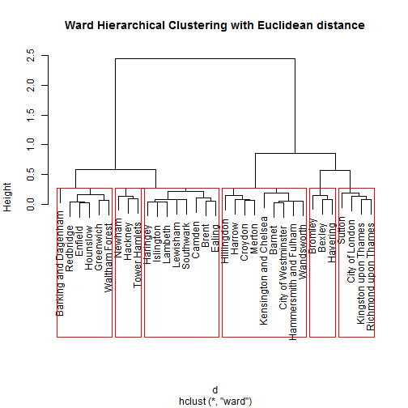 

```r
clusplot(votes/rowSums(votes), groups, color = TRUE, shade = FALSE, labels = 2, 
    lines = 0, main = "Ward Hierarchical Clustering with Euclidean distance")
```

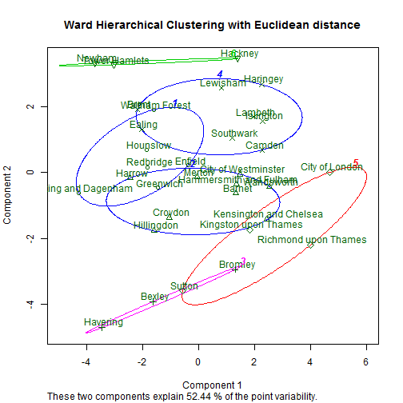 

```r

# Ward Hierarchical Clustering with Manhattan distance
d <- dist(votes/rowSums(votes), method = "manhattan")  # distance matrix
fit <- hclust(d, method = "ward")
plot(fit, main = "Ward Hierarchical Clustering with Manhattan distance")  # display dendogram
groups <- cutree(fit, k = numcluster)  # cut tree into clusters
# draw dendogram with red borders around the clusters
rect.hclust(fit, k = numcluster, border = "blue")
```

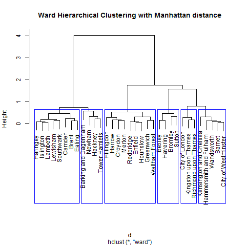 

```r
clusplot(votes/rowSums(votes), groups, color = TRUE, shade = FALSE, labels = 2, 
    lines = 0, main = "Ward Hierarchical Clustering with Manhattan distance")
```

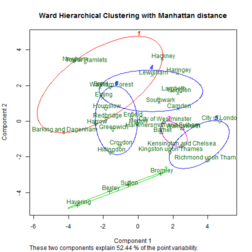 

```r

# 'Complete' Hierarchical Clustering with Manhattan distance
d <- dist(votes/rowSums(votes), method = "manhattan")  # distance matrix
fit <- hclust(d, method = "complete")
plot(fit, main = "'Complete' Hierarchical Clustering with Manhattan distance")  # display dendogram
groups <- cutree(fit, k = numcluster)  # cut tree into clusters
# draw dendogram with red borders around the clusters
rect.hclust(fit, k = numcluster, border = "green")
```

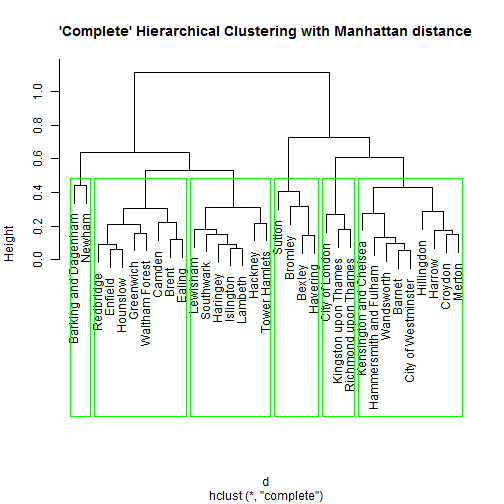 

```r
clusplot(votes/rowSums(votes), groups, color = TRUE, shade = FALSE, labels = 2, 
    lines = 0, main = "'Complete' Hierarchical Clustering with Manhattan distance")
```

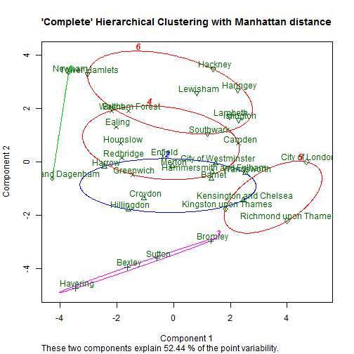 

```r

set.seed(2014)
# K-Means Clustering
fit <- kmeans(votes/rowSums(votes), algorithm = "Hartigan-Wong", centers = numcluster, 
    nstart = 1000)
# Cluster Plot against 1st 2 principal components vary parameters for most
# readable graph
clusplot(votes/rowSums(votes), fit$cluster, color = TRUE, shade = FALSE, labels = 2, 
    lines = 0, main = "Hartigan-Wong k-means clusterplot")
```

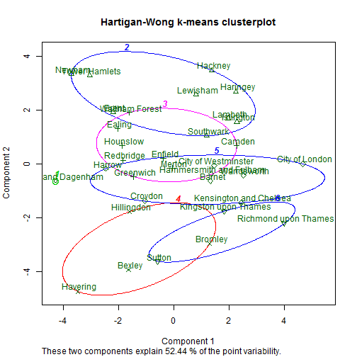 

```r
data.frame(cluster = fit$cluster[order(fit$cluster)])
```

```
##                        cluster
## Barking and Dagenham         1
## Brent                        2
## Hackney                      2
## Haringey                     2
## Islington                    2
## Lambeth                      2
## Lewisham                     2
## Newham                       2
## Southwark                    2
## Tower Hamlets                2
## Camden                       3
## Ealing                       3
## Enfield                      3
## Greenwich                    3
## Hounslow                     3
## Merton                       3
## Redbridge                    3
## Waltham Forest               3
## Bexley                       4
## Bromley                      4
## Havering                     4
## Hillingdon                   4
## Barnet                       5
## City of London               5
## City of Westminster          5
## Croydon                      5
## Hammersmith and Fulham       5
## Harrow                       5
## Kensington and Chelsea       5
## Wandsworth                   5
## Kingston upon Thames         6
## Richmond upon Thames         6
## Sutton                       6
```

```r

set.seed(2014)
# K-Means Clustering
fit <- kmeans(votes/rowSums(votes), algorithm = "Lloyd", iter.max = 20, centers = numcluster, 
    nstart = 1000)
# Cluster Plot against 1st 2 principal components vary parameters for most
# readable graph
library(cluster)
clusplot(votes/rowSums(votes), fit$cluster, color = TRUE, shade = FALSE, labels = 2, 
    lines = 0, main = "Lloyd-Forgy k-means clusterplot")
```

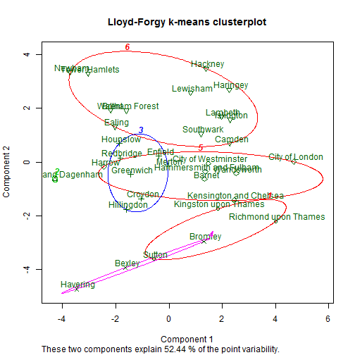 

```r
data.frame(cluster = fit$cluster[order(fit$cluster)])
```

```
##                        cluster
## Kingston upon Thames         1
## Richmond upon Thames         1
## Sutton                       1
## Barking and Dagenham         2
## Croydon                      3
## Enfield                      3
## Greenwich                    3
## Hillingdon                   3
## Hounslow                     3
## Merton                       3
## Redbridge                    3
## Bexley                       4
## Bromley                      4
## Havering                     4
## Barnet                       5
## City of London               5
## City of Westminster          5
## Hammersmith and Fulham       5
## Harrow                       5
## Kensington and Chelsea       5
## Wandsworth                   5
## Brent                        6
## Camden                       6
## Ealing                       6
## Hackney                      6
## Haringey                     6
## Islington                    6
## Lambeth                      6
## Lewisham                     6
## Newham                       6
## Southwark                    6
## Tower Hamlets                6
## Waltham Forest               6
```


Another approach would be to restrict the analysis to the five largest parties and their shares of the five-party totals in each borough. We could also exclude the small City of London to avoid it affecting borough clusters. Doing the same analysis produces the following.  

One noticeable effect is that two components of the cluster plot change (see in particular how Barking and Dagenham moves);  it should not be a suprise that they explain mor of the point variability as much of the variability has been removed with the minor parties.  


```r

voteslarger <- votes[-which(rownames(votes) == "City of London"), which(colnames(votes) %in% 
    c("Conservative Party", "Green Party", "Labour Party", "Liberal Democrats", 
        "UK Independence Party (UKIP)"))]
dim(voteslarger)
```

```
## [1] 32  5
```

```r
numcluster <- 6  # still arbitrary

# Ward Hierarchical Clustering with Euclidean distance
d <- dist(voteslarger/rowSums(voteslarger), method = "euclidean")  # distance matrix
fit <- hclust(d, method = "ward")
plot(fit, main = "Ward Hierarchical Clustering with Euclidean distance\n         using five larger parties")  # display dendogram
groups <- cutree(fit, k = numcluster)  # cut tree into clusters
# draw dendogram with red borders around the clusters
rect.hclust(fit, k = numcluster, border = "red")
```

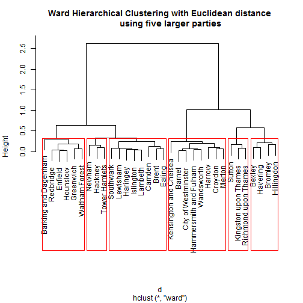 

```r
clusplot(voteslarger/rowSums(voteslarger), groups, color = TRUE, shade = FALSE, 
    labels = 2, lines = 0, main = "Ward Hierarchical Clustering with Euclidean distance\n         using five larger parties")
```

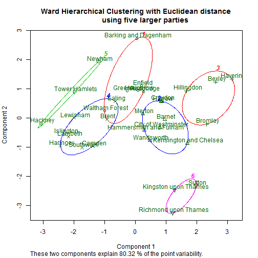 

```r

# Ward Hierarchical Clustering with Manhattan distance
d <- dist(voteslarger/rowSums(voteslarger), method = "manhattan")  # distance matrix
fit <- hclust(d, method = "ward")
plot(fit, main = "Ward Hierarchical Clustering with Manhattan distance\n         using five larger parties")  # display dendogram
groups <- cutree(fit, k = numcluster)  # cut tree into clusters
# draw dendogram with red borders around the clusters
rect.hclust(fit, k = numcluster, border = "blue")
```

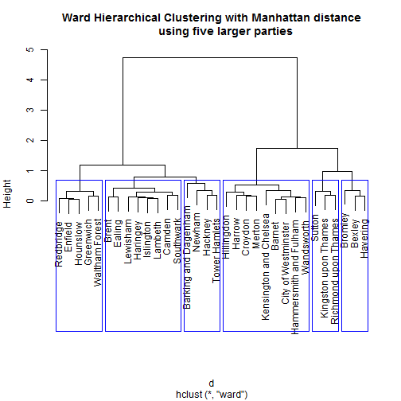 

```r
clusplot(voteslarger/rowSums(voteslarger), groups, color = TRUE, shade = FALSE, 
    labels = 2, lines = 0, main = "Ward Hierarchical Clustering with Manhattan distance\n         using five larger parties")
```

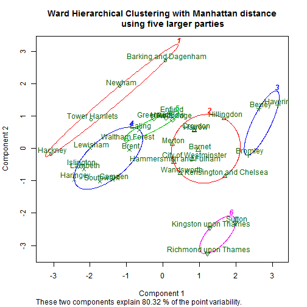 

```r

# 'Complete' Hierarchical Clustering with Manhattan distance
d <- dist(voteslarger/rowSums(voteslarger), method = "manhattan")  # distance matrix
fit <- hclust(d, method = "complete")
plot(fit, main = "'Complete' Hierarchical Clustering with Manhattan distance\n         using five larger parties")  # display dendogram
groups <- cutree(fit, k = numcluster)  # cut tree into clusters
# draw dendogram with red borders around the clusters
rect.hclust(fit, k = numcluster, border = "green")
```

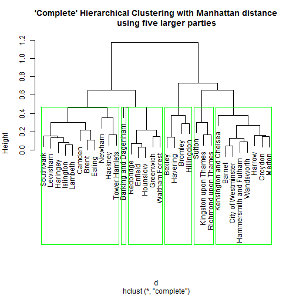 

```r
clusplot(voteslarger/rowSums(voteslarger), groups, color = TRUE, shade = FALSE, 
    labels = 2, lines = 0, main = "'Complete' Hierarchical Clustering with Manhattan distance\n         using five larger parties")
```

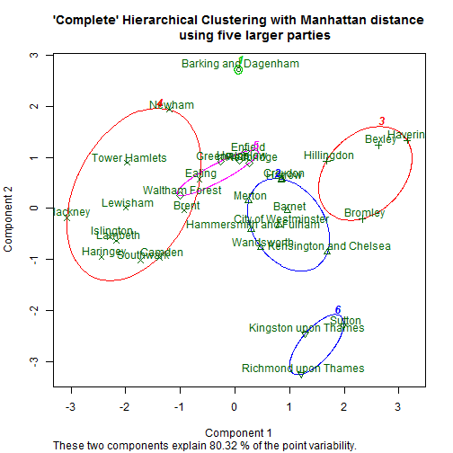 

```r

set.seed(2014)
# K-Means Clustering
fit <- kmeans(voteslarger/rowSums(voteslarger), algorithm = "Hartigan-Wong", 
    centers = numcluster, nstart = 1000)
# Cluster Plot against 1st 2 principal components vary parameters for most
# readable graph
clusplot(voteslarger/rowSums(voteslarger), fit$cluster, color = TRUE, shade = FALSE, 
    labels = 2, lines = 0, main = "Hartigan-Wong k-means clusterplot\n         using five larger parties")
```

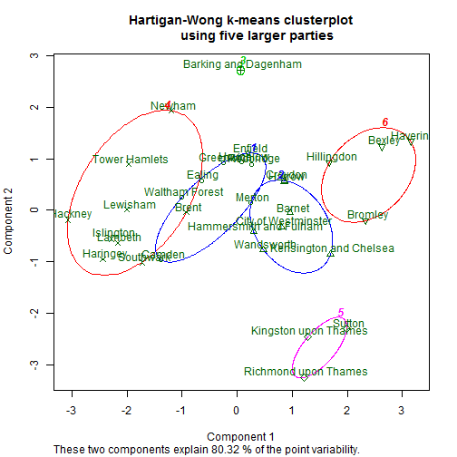 

```r
data.frame(cluster = fit$cluster[order(fit$cluster)])
```

```
##                        cluster
## Camden                       1
## Ealing                       1
## Enfield                      1
## Greenwich                    1
## Hounslow                     1
## Merton                       1
## Redbridge                    1
## Waltham Forest               1
## Barnet                       2
## City of Westminster          2
## Croydon                      2
## Hammersmith and Fulham       2
## Harrow                       2
## Kensington and Chelsea       2
## Wandsworth                   2
## Barking and Dagenham         3
## Brent                        4
## Hackney                      4
## Haringey                     4
## Islington                    4
## Lambeth                      4
## Lewisham                     4
## Newham                       4
## Southwark                    4
## Tower Hamlets                4
## Kingston upon Thames         5
## Richmond upon Thames         5
## Sutton                       5
## Bexley                       6
## Bromley                      6
## Havering                     6
## Hillingdon                   6
```

```r

set.seed(2014)
# K-Means Clustering
fit <- kmeans(voteslarger/rowSums(voteslarger), algorithm = "Lloyd", iter.max = 20, 
    centers = numcluster, nstart = 1000)
```

```
## Warning: empty cluster: try a better set of initial centers
## Warning: empty cluster: try a better set of initial centers
```

```r
# Cluster Plot against 1st 2 principal components vary parameters for most
# readable graph
clusplot(voteslarger/rowSums(voteslarger), fit$cluster, color = TRUE, shade = FALSE, 
    labels = 2, lines = 0, main = "Lloyd-Forgy k-means clusterplot\n         using five larger parties")
```

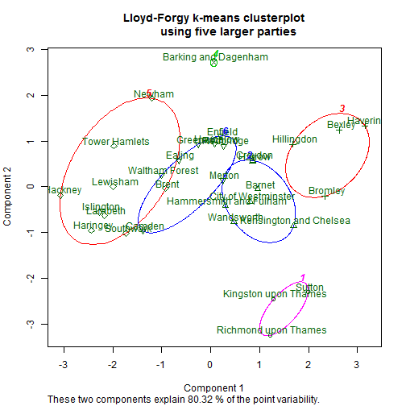 

```r
data.frame(cluster = fit$cluster[order(fit$cluster)])
```

```
##                        cluster
## Kingston upon Thames         1
## Richmond upon Thames         1
## Sutton                       1
## Barnet                       2
## City of Westminster          2
## Croydon                      2
## Hammersmith and Fulham       2
## Harrow                       2
## Kensington and Chelsea       2
## Wandsworth                   2
## Bexley                       3
## Bromley                      3
## Havering                     3
## Hillingdon                   3
## Barking and Dagenham         4
## Brent                        5
## Hackney                      5
## Haringey                     5
## Islington                    5
## Lambeth                      5
## Lewisham                     5
## Newham                       5
## Southwark                    5
## Tower Hamlets                5
## Camden                       6
## Ealing                       6
## Enfield                      6
## Greenwich                    6
## Hounslow                     6
## Merton                       6
## Redbridge                    6
## Waltham Forest               6
```


Although the clusters change with the different details of the clustering, there are some cluster relationships which seem faily stable: the outer south-western boroughs of Sutton, Kingston upon Thames, Richmond upon Thames, and usually Sutton, are often together; the outer eastern and south-eastern boroughs of Havering, Bexley, and Bromley are often together; the inner boroughs of Lambeth, Southwark, Lewisham, Islington, Camden, and Brent are often together, sometimes with Tower Hamlets and Newham; the more prosperous boroughs of the City of Westminster, Kensington and Chelsea, Hammersmith and Fulham, Wandsworth, Barnet, Harrow, and Croydon are often together; and the outer boroughs of Greenwich, Redbridge, Waltham Forest, Enfield, Ealing and Hounslow are often together.  Merton and Croydon are often with one of these two later groups, while Hillingdon is often with either with the outer eastern cluster (despite being in the west) or with the more prosperous cluster. Barking and Dagenham is often in its own cluster or with Newham and Tower Hamlets.           

A lot of this makes sense, either geographically, or in terms of which parties are or have historically been politically competitive in these particular boroughs.


Parties
-------

We repeat the analysis with the parties, but this time looking at what proportion of their votes come from different boroughs: this has a rescaling effect as these propoertions add up to 1 for each party whether they are large or small.  It is not longer possible to draw the clusterplots in the same way as they depend on principal component analysis, which does not work when there are more units than variables, i.e. when there are more boroughs than parties.  

Looking at all the parties, it is clear that parties clustered together need not have similar ideologies. For example the [4 Freedoms Party](http://www.4freedomsparty.eu/) appears to be a centre-right pro-EU party while [An Independence from Europe](http://www.aipmep.org/) appears to be a centre-left anti-EU party, but the two parties' vote distributions and indeed their vote totals were very similar; one posible explanation could be that both these small parties chose names which would put them at the top of the ballot paper, with the 4 Freedoms Party getting more votes from boroughs where a disproportionate number of people simply voted for the party at the top, and An Independence from Europe got votes from similar types of people in similar places who chose the first anti-EU party they found rather than searching for NO2EU or UKIP at the bottom of the ballot paper. 

The different clustering analyses did not find a stable cluster for the Green Party: it was sometimes clustered with the Labour Party, sometimes with the Conservative Party, sometimes with the Liberal Democrats, and sometimes with none of the other larger parties, though usually with the National Health Action Party.  Nor did it find a stable cluster for the Conservative Party, which was sometimes clustered with UKIP, sometimes with the Labour Party, and sometimes with the Green Party. Curiously, it was never clustered with its current national coalition partner the Liberal Democrats.     


```r
library(cluster)  # for cluster plots
numcluster <- 6  # arbitrary

# Ward Hierarchical Clustering with Euclidean distance
d <- dist(t(votes)/colSums(votes), method = "euclidean")  # distance matrix
fit <- hclust(d, method = "ward")
plot(fit, main = "Ward Hierarchical Clustering with Euclidean distance")  # display dendogram
groups <- cutree(fit, k = numcluster)  # cut tree into clusters
# draw dendogram with red borders around the clusters
rect.hclust(fit, k = numcluster, border = "red")
```

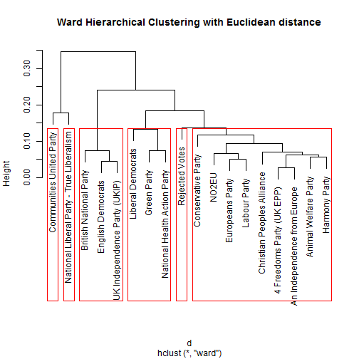 

```r

# Ward Hierarchical Clustering with Manhattan distance
d <- dist(t(votes)/colSums(votes), method = "manhattan")  # distance matrix
fit <- hclust(d, method = "ward")
plot(fit, main = "Ward Hierarchical Clustering with Manhattan distance")  # display dendogram
groups <- cutree(fit, k = numcluster)  # cut tree into clusters
# draw dendogram with red borders around the clusters
rect.hclust(fit, k = numcluster, border = "blue")
```

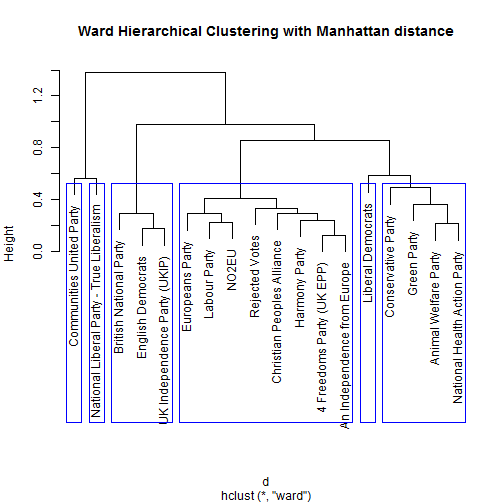 

```r

# 'Complete' Hierarchical Clustering with Manhattan distance
d <- dist(t(votes)/colSums(votes), method = "manhattan")  # distance matrix
fit <- hclust(d, method = "complete")
plot(fit, main = "'Complete' Hierarchical Clustering with Manhattan distance")  # display dendogram
groups <- cutree(fit, k = numcluster)  # cut tree into clusters
# draw dendogram with red borders around the clusters
rect.hclust(fit, k = numcluster, border = "green")
```

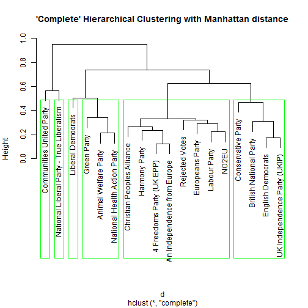 

```r

set.seed(2014)
# K-Means Clustering
fit <- kmeans(t(votes)/colSums(votes), algorithm = "Hartigan-Wong", centers = numcluster, 
    nstart = 1000)
data.frame(cluster = fit$cluster[order(fit$cluster)])
```

```
##                                          cluster
## Communities United Party                       1
## National Liberal Party - True Liberalism       2
## 4 Freedoms Party (UK EPP)                      3
## An Independence from Europe                    3
## Animal Welfare Party                           3
## Christian Peoples Alliance                     3
## Europeans Party                                3
## Green Party                                    3
## Harmony Party                                  3
## Labour Party                                   3
## National Health Action Party                   3
## NO2EU                                          3
## Liberal Democrats                              4
## Rejected Votes                                 5
## British National Party                         6
## Conservative Party                             6
## English Democrats                              6
## UK Independence Party (UKIP)                   6
```

```r

set.seed(2014)
# K-Means Clustering
fit <- kmeans(t(votes)/colSums(votes), algorithm = "Lloyd", iter.max = 20, centers = numcluster, 
    nstart = 1000)
data.frame(cluster = fit$cluster[order(fit$cluster)])
```

```
##                                          cluster
## Liberal Democrats                              1
## Communities United Party                       2
## 4 Freedoms Party (UK EPP)                      3
## An Independence from Europe                    3
## Animal Welfare Party                           3
## Christian Peoples Alliance                     3
## Europeans Party                                3
## Green Party                                    3
## Harmony Party                                  3
## Labour Party                                   3
## National Health Action Party                   3
## NO2EU                                          3
## National Liberal Party - True Liberalism       4
## Rejected Votes                                 5
## British National Party                         6
## Conservative Party                             6
## English Democrats                              6
## UK Independence Party (UKIP)                   6
```


We could again to restrict the analysis to the five largest parties and again exclude the small City of London. Since we only have five parties, we have to use fewer clusters, and three clusters are shown here. Repeating the analysis changes the results more than might be expected: in every case the Green Party is clustered with the Labour Party and the Conservative Party is clustered with UKIP. 

Removal of the smaller parties should not change the distribution of individual party votes across boroughs, but it does affect clustering algorithms in that they no longer build up clusters of smaller parties before incorporating larger parties.  This suggests that the algorithms might suffer from a lack of independence from irrelevant alternatives.


```r

voteslarger <- votes[-which(rownames(votes) == "City of London"), which(colnames(votes) %in% 
    c("Conservative Party", "Green Party", "Labour Party", "Liberal Democrats", 
        "UK Independence Party (UKIP)"))]
dim(voteslarger)
```

```
## [1] 32  5
```

```r
numcluster <- 3  # arbitrary but 6 clusters would be too many with only 5 large parties

# Ward Hierarchical Clustering with Euclidean distance
d <- dist(t(voteslarger)/colSums(voteslarger), method = "euclidean")  # distance matrix
fit <- hclust(d, method = "ward")
plot(fit, main = "Ward Hierarchical Clustering with Euclidean distance\n         using five larger parties")  # display dendogram
groups <- cutree(fit, k = numcluster)  # cut tree into clusters
# draw dendogram with red borders around the clusters
rect.hclust(fit, k = numcluster, border = "red")
```

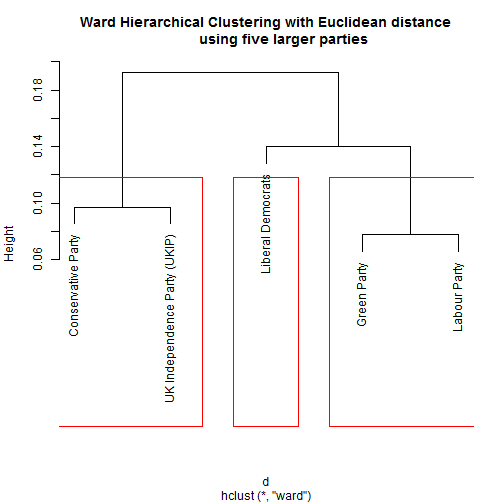 

```r

# Ward Hierarchical Clustering with Manhattan distance
d <- dist(t(voteslarger)/colSums(voteslarger), method = "manhattan")  # distance matrix
fit <- hclust(d, method = "ward")
plot(fit, main = "Ward Hierarchical Clustering with Manhattan distance\n         using five larger parties")  # display dendogram
groups <- cutree(fit, k = numcluster)  # cut tree into clusters
# draw dendogram with red borders around the clusters
rect.hclust(fit, k = numcluster, border = "blue")
```

 

```r

# 'Complete' Hierarchical Clustering with Manhattan distance
d <- dist(t(voteslarger)/colSums(voteslarger), method = "manhattan")  # distance matrix
fit <- hclust(d, method = "complete")
plot(fit, main = "'Complete' Hierarchical Clustering with Manhattan distance\n         using five larger parties")  # display dendogram
groups <- cutree(fit, k = numcluster)  # cut tree into clusters
# draw dendogram with red borders around the clusters
rect.hclust(fit, k = numcluster, border = "green")
```

 

```r

set.seed(2014)
# K-Means Clustering
fit <- kmeans(t(voteslarger)/colSums(voteslarger), algorithm = "Hartigan-Wong", 
    centers = numcluster, nstart = 1000)
data.frame(cluster = fit$cluster[order(fit$cluster)])
```

```
##                              cluster
## Green Party                        1
## Labour Party                       1
## Liberal Democrats                  2
## Conservative Party                 3
## UK Independence Party (UKIP)       3
```

```r

set.seed(2014)
# K-Means Clustering
fit <- kmeans(t(voteslarger)/colSums(voteslarger), algorithm = "Lloyd", iter.max = 20, 
    centers = numcluster, nstart = 1000)
data.frame(cluster = fit$cluster[order(fit$cluster)])
```

```
##                              cluster
## Liberal Democrats                  1
## Green Party                        2
## Labour Party                       2
## Conservative Party                 3
## UK Independence Party (UKIP)       3
```


Conclusion
==========

Looking at different clustering algorithms on a single data set suggests that some cluster results are sensitive to the particular method used and to the presence of what may be distracting data, while other cluster results are more stable.

A possible lesson to draw from this is that it could be worth using more than one algortithm in other clustering exercises to identify whether results are dependent on the precise method used. 


Annex A
=======

For those who want the `votes` matrix without using the csv file or the data preparation steps, they can just set `votes` to the output of this `dput` statement.


```r
dput(votes)
```

```
## structure(c(777, 938, 999, 1038, 1034, 693, 18, 433, 1366, 1636, 
## 807, 1158, 528, 649, 512, 1097, 1468, 917, 972, 639, 269, 439, 
## 690, 645, 796, 889, 1010, 605, 833, 1003, 1508, 890, 758, 595, 
## 1071, 851, 986, 821, 640, 5, 414, 1359, 1525, 947, 844, 589, 
## 518, 537, 1376, 1203, 990, 955, 467, 215, 474, 643, 681, 659, 
## 1005, 1078, 476, 714, 1014, 1340, 951, 732, 309, 961, 638, 647, 
## 901, 636, 17, 423, 989, 977, 666, 650, 564, 516, 598, 794, 715, 
## 776, 652, 582, 347, 505, 724, 706, 583, 502, 679, 687, 633, 580, 
## 623, 667, 845, 1151, 464, 1184, 689, 625, 356, 10, 217, 1031, 
## 841, 594, 788, 311, 272, 287, 640, 1355, 932, 659, 349, 156, 
## 311, 416, 527, 453, 729, 662, 254, 561, 612, 835, 583, 392, 672, 
## 792, 706, 982, 891, 338, 10, 324, 1448, 1180, 833, 814, 651, 
## 413, 488, 758, 873, 687, 593, 377, 259, 586, 864, 1116, 721, 
## 1449, 955, 359, 898, 609, 482, 869, 705, 93, 237, 88, 362, 91, 
## 92, 1, 86, 184, 533, 185, 109, 190, 77, 104, 336, 92, 218, 500, 
## 78, 53, 86, 139, 89, 107, 1124, 492, 62, 95, 66, 542, 286, 154, 
## 3728, 32234, 17575, 13277, 30573, 11343, 686, 14191, 26687, 19108, 
## 17432, 10236, 7367, 14473, 7159, 22388, 19590, 20022, 14734, 
## 6621, 12344, 14682, 10449, 8161, 14793, 12398, 19458, 21822, 
## 9152, 14810, 9647, 9442, 29057, 248, 354, 556, 377, 531, 156, 
## 7, 130, 494, 356, 327, 361, 156, 168, 155, 326, 881, 501, 310, 
## 155, 118, 266, 208, 336, 242, 249, 397, 241, 283, 477, 284, 269, 
## 223, 263, 497, 109, 512, 240, 272, 22, 245, 381, 788, 325, 344, 
## 283, 284, 291, 391, 186, 362, 446, 228, 175, 203, 348, 392, 356, 
## 432, 332, 222, 329, 203, 546, 285, 420, 1335, 7362, 3035, 5123, 
## 7590, 8132, 291, 3318, 6829, 6997, 5115, 5482, 11608, 4451, 9669, 
## 3859, 3501, 3695, 4425, 9003, 2389, 4671, 11140, 10228, 4532, 
## 3449, 4570, 7151, 9710, 3668, 8679, 7078, 8334, 35, 71, 38, 111, 
## 72, 34, 1, 38, 90, 103, 64, 55, 70, 36, 47, 97, 82, 68, 80, 37, 
## 21, 40, 58, 109, 45, 67, 49, 37, 53, 46, 104, 72, 55, 22369, 
## 28774, 14142, 34451, 14915, 23294, 546, 13119, 32439, 43436, 
## 32091, 25788, 35491, 15520, 30757, 25444, 12331, 21198, 27747, 
## 27328, 6419, 8094, 34471, 32507, 21832, 43582, 33528, 8276, 31591, 
## 7958, 43463, 28205, 25853, 594, 4418, 1592, 7333, 5420, 5568, 
## 311, 2699, 3768, 5476, 2309, 2578, 3707, 3020, 7323, 2692, 1529, 
## 2456, 2600, 5136, 1948, 8646, 6432, 4252, 3908, 1423, 3504, 12279, 
## 9170, 12104, 3379, 4416, 6023, 226, 970, 870, 697, 1186, 667, 
## 33, 435, 744, 894, 826, 852, 695, 554, 778, 617, 654, 578, 598, 
## 686, 242, 488, 844, 2137, 514, 557, 788, 550, 865, 493, 659, 
## 743, 813, 100, 153, 84, 463, 96, 42, 1, 49, 192, 685, 136, 110, 
## 66, 51, 103, 689, 83, 463, 370, 53, 24, 193, 58, 106, 245, 335, 
## 1077, 43, 74, 157, 105, 254, 76, 90, 141, 116, 140, 94, 100, 
## 2, 68, 126, 138, 156, 113, 166, 63, 178, 122, 125, 144, 122, 
## 119, 36, 67, 115, 147, 97, 159, 139, 60, 119, 68, 154, 233, 87, 
## 12759, 14039, 25642, 6414, 29386, 5337, 313, 5680, 19560, 10632, 
## 14271, 13341, 3220, 5736, 4515, 10036, 34560, 19746, 11443, 5652, 
## 4319, 9570, 5767, 8720, 9498, 6216, 12965, 9714, 8035, 16345, 
## 7861, 10677, 9164, 386, 767, 588, 1333, 694, 543, 7, 518, 872, 
## 1326, 842, 579, 739, 466, 684, 852, 850, 779, 675, 474, 354, 
## 342, 596, 612, 604, 1177, 919, 401, 685, 537, 3327, 898, 781), .Dim = c(33L, 
## 18L), .Dimnames = list(c("Barking and Dagenham", "Barnet", "Bexley", 
## "Brent", "Bromley", "Camden", "City of London", "City of Westminster", 
## "Croydon", "Ealing", "Enfield", "Greenwich", "Hackney", "Hammersmith and Fulham", 
## "Haringey", "Harrow", "Havering", "Hillingdon", "Hounslow", "Islington", 
## "Kensington and Chelsea", "Kingston upon Thames", "Lambeth", 
## "Lewisham", "Merton", "Newham", "Redbridge", "Richmond upon Thames", 
## "Southwark", "Sutton", "Tower Hamlets", "Waltham Forest", "Wandsworth"
## ), structure(c("4 Freedoms Party (UK EPP)", "An Independence from Europe", 
## "Animal Welfare Party", "British National Party", "Christian Peoples Alliance", 
## "Communities United Party", "Conservative Party", "English Democrats", 
## "Europeans Party", "Green Party", "Harmony Party", "Labour Party", 
## "Liberal Democrats", "National Health Action Party", "National Liberal Party - True Liberalism", 
## "NO2EU", "UK Independence Party (UKIP)", "Rejected Votes"), .Names = c("V2", 
## "V3", "V4", "V5", "V6", "V7", "V8", "V9", "V10", "V11", "V12", 
## "V13", "V14", "V15", "V16", "V17", "V18", "V19"))))
```


In other words, use:

```
votes <- structure(c(777, 938, 999, 1038, 1034, 693, 18, 433, 1366, 1636, 
807, 1158, 528, 649, 512, 1097, 1468, 917, 972, 639, 269, 439, 
690, 645, 796, 889, 1010, 605, 833, 1003, 1508, 890, 758, 595, 
1071, 851, 986, 821, 640, 5, 414, 1359, 1525, 947, 844, 589, 
518, 537, 1376, 1203, 990, 955, 467, 215, 474, 643, 681, 659, 
1005, 1078, 476, 714, 1014, 1340, 951, 732, 309, 961, 638, 647, 
901, 636, 17, 423, 989, 977, 666, 650, 564, 516, 598, 794, 715, 
776, 652, 582, 347, 505, 724, 706, 583, 502, 679, 687, 633, 580, 
623, 667, 845, 1151, 464, 1184, 689, 625, 356, 10, 217, 1031, 
841, 594, 788, 311, 272, 287, 640, 1355, 932, 659, 349, 156, 
311, 416, 527, 453, 729, 662, 254, 561, 612, 835, 583, 392, 672, 
792, 706, 982, 891, 338, 10, 324, 1448, 1180, 833, 814, 651, 
413, 488, 758, 873, 687, 593, 377, 259, 586, 864, 1116, 721, 
1449, 955, 359, 898, 609, 482, 869, 705, 93, 237, 88, 362, 91, 
92, 1, 86, 184, 533, 185, 109, 190, 77, 104, 336, 92, 218, 500, 
78, 53, 86, 139, 89, 107, 1124, 492, 62, 95, 66, 542, 286, 154, 
3728, 32234, 17575, 13277, 30573, 11343, 686, 14191, 26687, 19108, 
17432, 10236, 7367, 14473, 7159, 22388, 19590, 20022, 14734, 
6621, 12344, 14682, 10449, 8161, 14793, 12398, 19458, 21822, 
9152, 14810, 9647, 9442, 29057, 248, 354, 556, 377, 531, 156, 
7, 130, 494, 356, 327, 361, 156, 168, 155, 326, 881, 501, 310, 
155, 118, 266, 208, 336, 242, 249, 397, 241, 283, 477, 284, 269, 
223, 263, 497, 109, 512, 240, 272, 22, 245, 381, 788, 325, 344, 
283, 284, 291, 391, 186, 362, 446, 228, 175, 203, 348, 392, 356, 
432, 332, 222, 329, 203, 546, 285, 420, 1335, 7362, 3035, 5123, 
7590, 8132, 291, 3318, 6829, 6997, 5115, 5482, 11608, 4451, 9669, 
3859, 3501, 3695, 4425, 9003, 2389, 4671, 11140, 10228, 4532, 
3449, 4570, 7151, 9710, 3668, 8679, 7078, 8334, 35, 71, 38, 111, 
72, 34, 1, 38, 90, 103, 64, 55, 70, 36, 47, 97, 82, 68, 80, 37, 
21, 40, 58, 109, 45, 67, 49, 37, 53, 46, 104, 72, 55, 22369, 
28774, 14142, 34451, 14915, 23294, 546, 13119, 32439, 43436, 
32091, 25788, 35491, 15520, 30757, 25444, 12331, 21198, 27747, 
27328, 6419, 8094, 34471, 32507, 21832, 43582, 33528, 8276, 31591, 
7958, 43463, 28205, 25853, 594, 4418, 1592, 7333, 5420, 5568, 
311, 2699, 3768, 5476, 2309, 2578, 3707, 3020, 7323, 2692, 1529, 
2456, 2600, 5136, 1948, 8646, 6432, 4252, 3908, 1423, 3504, 12279, 
9170, 12104, 3379, 4416, 6023, 226, 970, 870, 697, 1186, 667, 
33, 435, 744, 894, 826, 852, 695, 554, 778, 617, 654, 578, 598, 
686, 242, 488, 844, 2137, 514, 557, 788, 550, 865, 493, 659, 
743, 813, 100, 153, 84, 463, 96, 42, 1, 49, 192, 685, 136, 110, 
66, 51, 103, 689, 83, 463, 370, 53, 24, 193, 58, 106, 245, 335, 
1077, 43, 74, 157, 105, 254, 76, 90, 141, 116, 140, 94, 100, 
2, 68, 126, 138, 156, 113, 166, 63, 178, 122, 125, 144, 122, 
119, 36, 67, 115, 147, 97, 159, 139, 60, 119, 68, 154, 233, 87, 
12759, 14039, 25642, 6414, 29386, 5337, 313, 5680, 19560, 10632, 
14271, 13341, 3220, 5736, 4515, 10036, 34560, 19746, 11443, 5652, 
4319, 9570, 5767, 8720, 9498, 6216, 12965, 9714, 8035, 16345, 
7861, 10677, 9164, 386, 767, 588, 1333, 694, 543, 7, 518, 872, 
1326, 842, 579, 739, 466, 684, 852, 850, 779, 675, 474, 354, 
342, 596, 612, 604, 1177, 919, 401, 685, 537, 3327, 898, 781), .Dim = c(33L, 
18L), .Dimnames = list( c("Barking and Dagenham", "Barnet", "Bexley", 
"Brent", "Bromley", "Camden", "City of London", "City of Westminster", 
"Croydon", "Ealing", "Enfield", "Greenwich", "Hackney", "Hammersmith and Fulham", 
"Haringey", "Harrow", "Havering", "Hillingdon", "Hounslow", "Islington", 
"Kensington and Chelsea", "Kingston upon Thames", "Lambeth", 
"Lewisham", "Merton", "Newham", "Redbridge", "Richmond upon Thames", 
"Southwark", "Sutton", "Tower Hamlets", "Waltham Forest", "Wandsworth"
), c("4 Freedoms Party (UK EPP)", "An Independence from Europe", 
"Animal Welfare Party", "British National Party", "Christian Peoples Alliance", 
"Communities United Party", "Conservative Party", "English Democrats", 
"Europeans Party", "Green Party", "Harmony Party", "Labour Party", 
"Liberal Democrats", "National Health Action Party", "National Liberal Party - True Liberalism", 
"NO2EU", "UK Independence Party (UKIP)", "Rejected Votes")))
```

